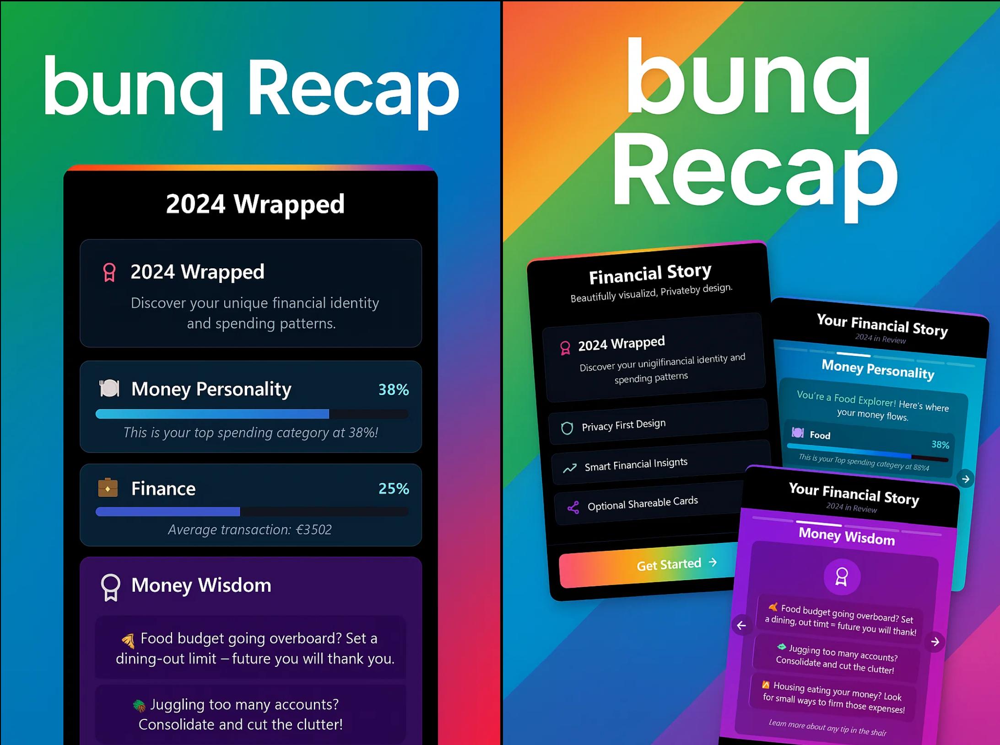

# Buniq

We were inspired by the year-end magic of Spotify Wrapped and the idea that banking could offer a similarly engaging “memory lane” experience. 

While brainstorming at the bunq 6.0 hackathon kickoff, we realized that most people never get a holistic, fun summary of their own spending habits—let alone insights into the carbon footprint of their purchases or the hidden fees in their subscription services. 

That “aha” moment drove us to build a single dashboard that transforms raw transaction data into a rich, personalized recap.